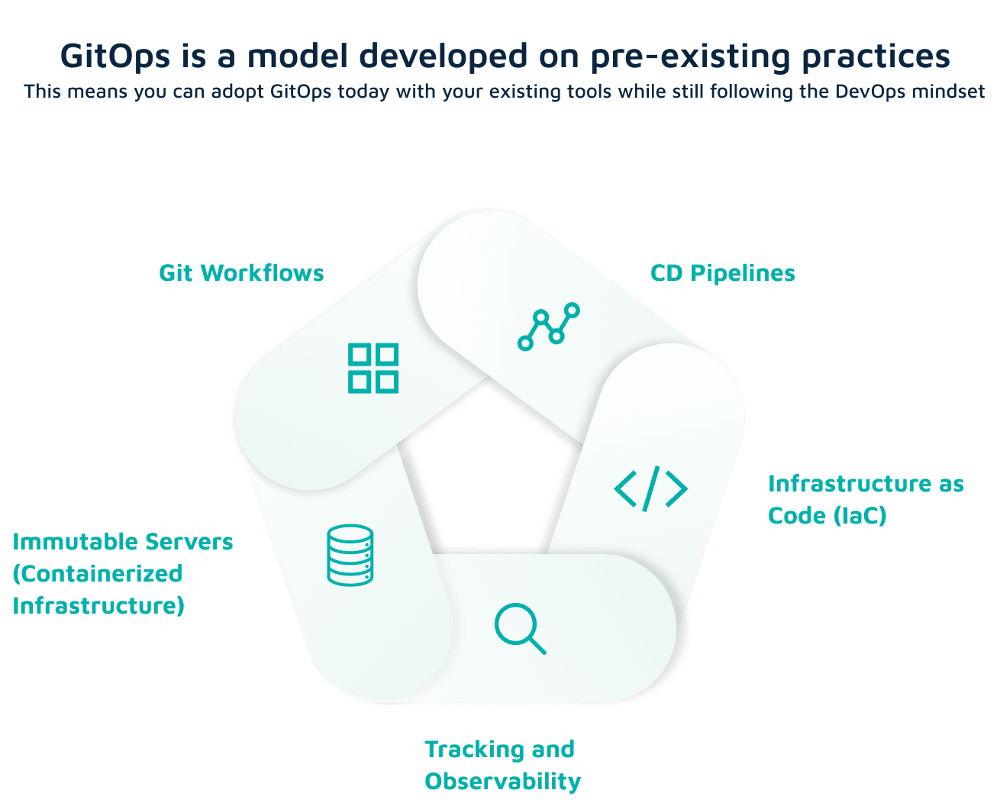
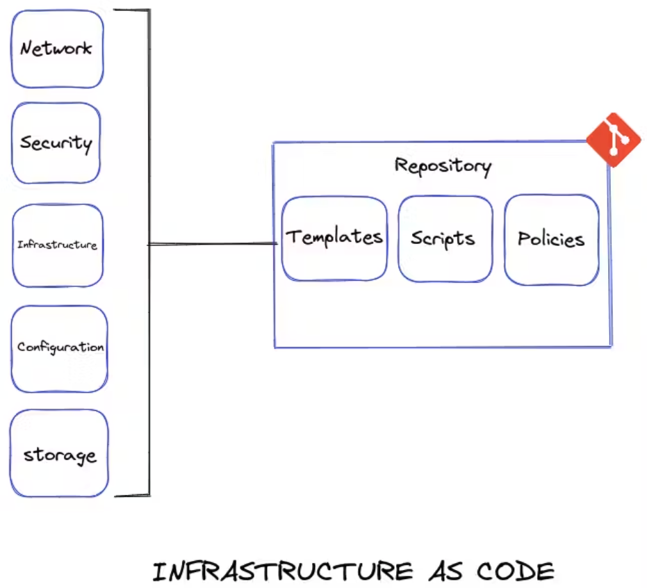
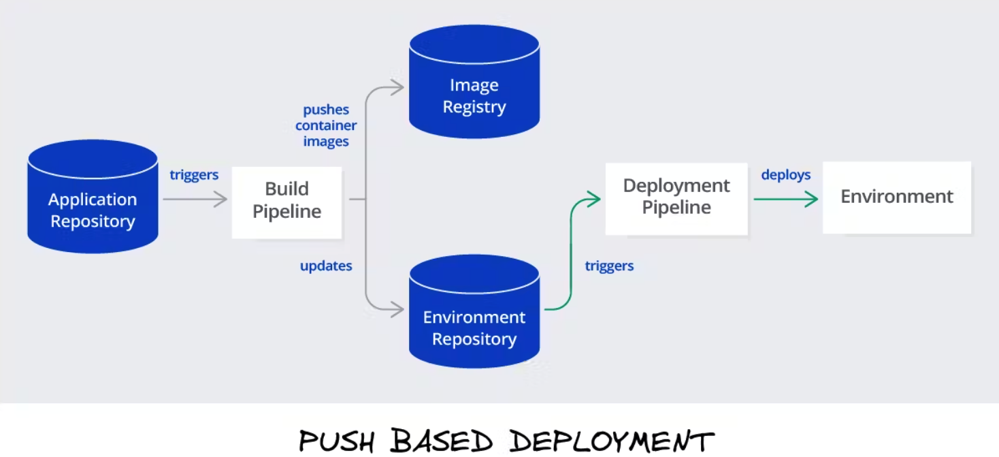
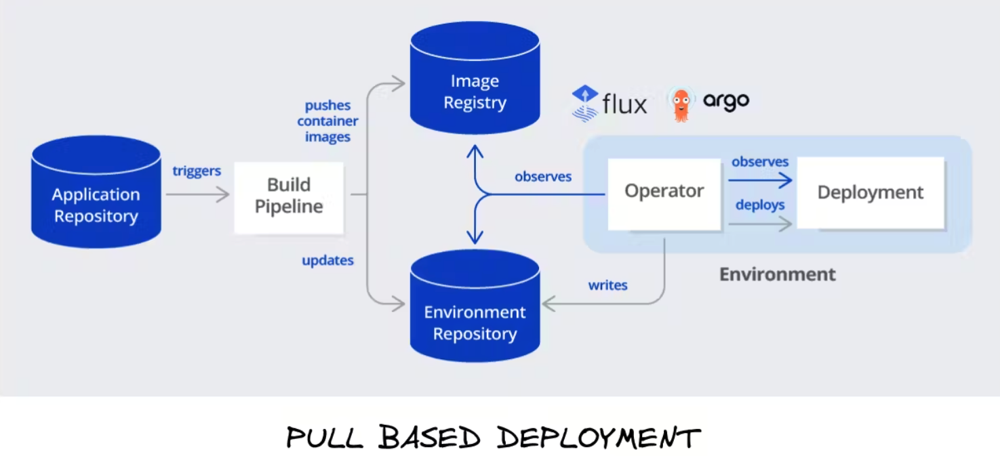

# GitOps (Git + Operations)

GitOps is **a set of best practices** that make Git the source of truth for everything (and not just the application source code). With GitOps you describe your whole platform (infrastructure and applications) in a declarative format and use Git for storage, history, and auditing of your deployments. Discarding custom deployment scripts and adopting a GitOps approach can help you avoid failed deployments, configuration drift, and fragile releases.

**The core idea of GitOps is having declarative descriptions of desired state of production in a Git repository like source code and an automated process to match these desired and current states of production.** It allows developers to only push commits to the repository whenever they make deployment to the production environment while automated system handles everything else.

## Practices

It’s easy to get started with GitOps, because is a model developed on pre-existing practices:

- **Git workflows** – GitOps uses Git repositories as the change mechanism for application and infrastructure updates. Any change to an application or environment is represented as a change in a Git repository – providing a full audit trail and the ability to roll back to a previous version at any time.
- **CD pipelines** – with GitOps you have a clear separation between CI and CD. Your CI pipelines stay as is and their end result is still an artifact and/or container that is stored in a binary repository. Once the artifact is created, GitOps takes over and applies it to the target cluster. Instead of triggering the CI/CD with a commit in the source code, with GitOps the trigger is a commit to the configuration repository.
- **Infrastructure as Code (IaC)** – GitOps uses a Git repository as the single source of truth for your environments. Infrastructure as code (IaC) means storing all infrastructure configuration as code in a version control system. IaC systems use declarative configuration, meaning you only state what you need deployed, not how.
- **Tracking and observability** – observability, a property of a system which allows it to be easily observed, is an important GitOps concept. It lets you ensure that the desired state described in declarative configuration, and actual current state, are the same.
- **Immutable servers (containerized infrastructure)** – GitOps is often used to operate Kubernetes application development. It lets you build development pipelines, continuously deploy applications, provision clusters, and deploy on Kubernetes or container registries. However, GitOps can also be used in other infrastructure environments.

This means you can adopt GitOps today with your existing tools while still following the DevOps mindset.

## Core Components

### Infrastructure as Code

IaC means to define the whole infrastructure into code, not only infrastructure but also Network, Security, Configuration, and Policy.

### Pull Requests

Pull requests (PRs) as the change mechanism for all infrastructure updates. The PR is where teams can collaborate via reviews and comments and where formal approvals take place. A merge commits to your main (or trunk) branch and serves as an audit log or audit trail.

### CI/CD

When new code is merged, the CI/CD pipeline enacts the change in the environment. Any configuration drift, such as manual changes or errors, is overwritten by GitOps automation so the environment converges on the desired state defined in Git.

## Benefits

- **Increased developer productivity** – GitOps lets developers use familiar tools like Git to manage updates and features, without having to deal with containers or know the internal of Kubernetes.
- **Minimize failed deployments and rapidly recover from downtime** – Git provides the ability to revert, rollback, and fork, enabling easy rollback if anything goes wrong in a production environment. Git provides a single source of truth, reducing time to recovery to minutes or seconds.
- **Faster time to ship features in production** – GitOps lets developers continuously deploy feature updates to Kubernetes clusters. Deployments become instant, consistent, and reliable.
- **Built-in auditing history** – when you use Git to manage Kubernetes clusters, you gain a complete audit log of all changes to the cluster originating outside of Kubernetes with a full audit trail of who changed what. This enables consistent operations and supports compliance.
- **Greater visibility on the lifecycle of developed features** – GitOps provides a consistent model for infrastructure and application changes across the organization. Development processes are visible and fully reproducible through Git.
- **Improved security** – Git provides strong guarantees on correctness and security, with strong cryptography used to manage changes and verify authorship. This dramatically improves security and means that CI systems are no longer a threat vector for production systems.

These benefits are applicable to both operators/service engineers, as well as developers who need a more robust operational solution for application development and infrastructure automation.

## How does GitOps work?

### Environment Configurations as Git repository

GitOps organizes the deployment process around code repositories as the central element. There are at least **two repositories: the application repository and the environment configuration repository**. The application repository contains the source code of the application and the deployment manifests to deploy the application. The environment configuration repository contains all deployment manifests of the currently desired infrastructure of an deployment environment. It describes what applications and infrastructural services (message broker, service mesh, monitoring tool, …) should run with what configuration and version in the deployment environment.

### Push-based vs. Pull-based Deployments

There are two ways to implement the deployment strategy for GitOps: Push-based and Pull-based deployments. The difference between the two deployment types is how it is ensured, that the deployment environment actually resembles the desired infrastructure. When possible, the Pull-based approach should be preferred as it is considered the more secure and thus better practice to implement GitOps.

- Push Base Deployment: This is the traditionally used way by various tools like Jenkins, and Gitlab. Here, the pipeline executes a certain command to push the code to the environment.
  
- Pull Base Deployment: Here, we have an agent installed into our environment itself, which is linked to the repository itself. It keeps on checking for any change made to the repository and automatically pulls and deploys if there is any change. Tools that use the Pull Base Deployment are ArgoCD and FluxCD.
  

## [FAQs](https://www.gitops.tech/#faq)

# References

- https://about.gitlab.com/topics/gitops/
- https://www.gitops.tech/
- https://blog.kubesimplify.com/an-overview-of-gitops-and-argocd
- https://codefresh.io/learn/gitops/
