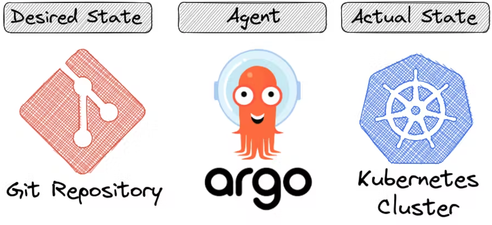
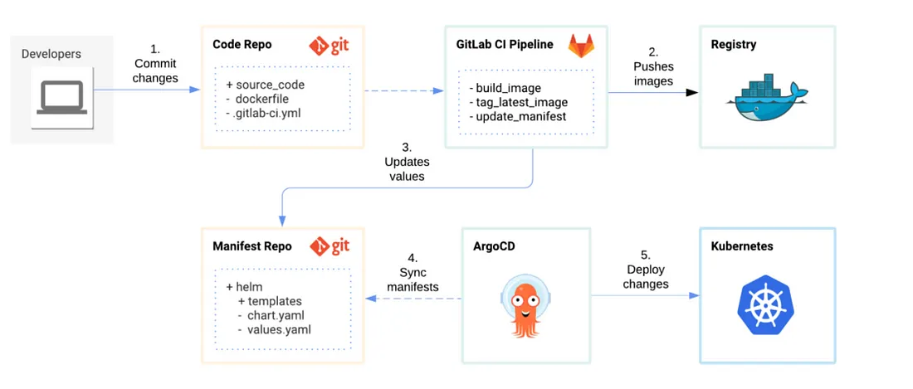

# ArgoCD

ArgoCD is a continuous delivery tool that helps you to deploy your applications into multiple environment in a declarative and in the GitOps way.

## CD workflows

### CD workflow without ArgoCD

Let's say we use Jenkins for the CI/CD pipeline. Now, when a new change gets committed into the main repository, it will undergo various builds and tests to test that it does not break anything. It might even build a new docker image. This whole process falls under the CI pipeline.

Now Jenkins will push these changes to the environment using kubectl or helm or any other commands. I've stated the challenges we might face while any **push-based deployment** tool below:

- Install tools like kubectl or helm.
- Provide Jenkins access to the Kubernetes cluster. If we are using EKS, we'll have to provide Jenkins access to the AWS. This might create a serious security risk.
- Once Jenkins has deployed any change into the environment, it loses access to the cluster, making it impossible to check whether the change has been successfully deployed or not.

### CD workflow with ArgoCD

ArgoCD follows the GitOps principles, which means that it uses the **pull-based deployment**.

ArgoCD is an agent which we install inside our Kubernetes cluster and then bind it to a git repository. ArgoCD will keep looking for any change in the repository and as soon as a change is made in the repository, ArgoCD will pull it and apply it to the Kubernetes cluster.

Now, our configuration might contain more than just YAML files and might also contain secrets, services, ingress, hence it is a best practice to separate our application code and the configuration code into two different repositories.

This way, there is would be no need to run the entire CI pipeline when there is a change to any service or any configuration.

This way, Jenkins will update the manifest file in the configuration repository and ArgoCD will auto fetch the change and apply it into the environment.

## Advantages of using ArgoCD

- Everything is **version controlled**, means we can keep a check that who made which change.
- We can easily **rollback** to any old state if anything breaks after applying any change.
- Git is the single **source of truth**. Even if a change is made manually to the cluster, ArgoCD will keep a check on the desired state and the actual state. And since the actual state was changed, it will automatically roll back the changes made to the cluster. This way, ArgoCD keeps a check on both, the repository and the cluster itself.
- Git allows us to set up access rules so that any team member can submit a **pull request**, while only senior members can merge. This way, we don't need to create ClusterRole and User resources in kubernetes.
- Cluster **disaster recovery**: Suppose I have an EKS cluster in region 1-a and this cluster completely crashes, then I can make a new cluster and point it to the same git repository. This will create the same cluster with the same configuration as earlier.
- We get a **real time update** of our application state even after the changes are made.

## Features

- Declarative and version controlled application deployments
- Automated deployment of applications to specified target environments
- Support for Kustomize and Helm application declarations
- CLI and a sweet web UI for Kubernetes resources
- **PreSync, Sync, PostSync** hooks to support complex application rollouts such as blue/green and canary upgrades

## Configure ArgoCD

ArgoCD is configured directly **into the Kubernetes** cluster itself, and it extends the Kubernetes API's with CRD's (custom resource definition). ArgoCD is installed in the Kubernetes cluster with the help of YAML file. In this file, we define which git repository should be synced with which Kubernetes cluster. It can be any git repository and any Kubernetes cluster rather, be it the cluster in which ArgoCD is installed or any other cluster that ArgoCD is managing.

If we have different cluster environments, such as deployment, staging, and production, then we deploy ArgoCD separately. **All these environments are configured with one single git repository** where all the configuration is stored.

## Use GitOps with ArgoCD

We have project repositories for each application in our team. Their responsibilities are:

- hold the source code and make static analysis on it
- compile and run unit & integration tests
- package the application and run automation tests
- create a deployable version of the application

And we have one global Manifest repository to manage infrastructure configurations of these applications. We manage where to deploy our apps and with what settings in this repository.

We keep declarative Kubernetes and ArgoCD configurations in here. And the job of ArgoCD is to make sure this Manifest repository and Kubernetes clusters are in sync.

Whenever a pull request is merged to the master branch of a code repository after running GitLab CI Pipeline, we update the image tag of stage environment on the Manifest repository with the last commit hash. Then by creating a release tag, we update the production environment’s manifest. We have a Golang script for this purpose.

# References

- https://medium.com/trendyol-tech/how-to-use-gitops-with-argocd-1782b8493cc3
