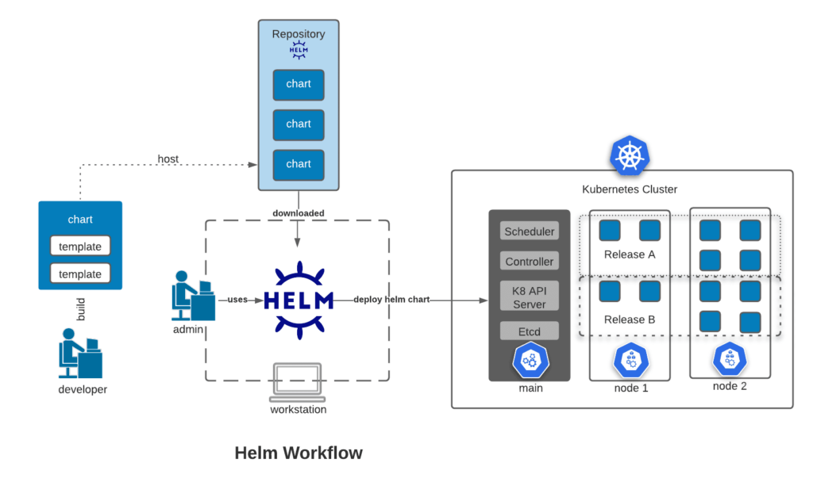

# Helm in GitOps

Helm, a tool used for **Kubernetes package management**, that also provides templating. Helm provides utilities that assist Kubernetes application deployment.

## Kubernetes

Kubernetes is **an orchestrator for containers** that allows you to automate scheduling, deployments, networking, scaling, and health monitoring for the containers.

Kubernetes was needed because we increased the usage of the following:

- Microservices
- Containers

This was difficult to manage with scripts and self-made tools and caused the need for orchestration technology like Kubernetes. It provides features like scalability, disaster recovery, and less downtime.

## Helm

Helm is a package manager for Kubernetes. It’s a convenient way for packaging collections of YAML files with a Helm chart for the Kubernetes application and allowing distribution with a Helm repository. 

### Helm Charts

Helm Charts are deployable units for Kubernetes applications. **These charts are a collection of files inside a directory**. This directory is the name of the Helm chart and consists of a self-descriptor file, YAML file, and one or more Kubernetes manifests. Helm charts are typically written in the Go template language. Charts are created as such files, describing a related set of Kubernetes resources. Here’s an example of a Helm chart directory and it’s layout:

This particular directory contains a `Chart.yaml` file and this is where the global variables, versions, and descriptions are stored. Then, the `templates` directory is what contains the YAML files for Kubernetes, otherwise known as the **Kubernetes manifests**.

Files such as the deployment, service, and ingress files contain variables from the `values.yaml` file when the chart is deployed. The _helpers.tpl incorporates helpful functions for variable calculations.

You can then share the Helm chart to increase easy reusability for others to use. Sharing is done by storing the chart to a Helm repository. This repository can then be shared with others to deploy the application with the chart.

### Helm Repositories

Helm supports a chart repository service that can be used to store the Helm charts. You can use any **web server host or source code host** for the Helm repository.

The repository has an `index.yaml` file that contains metadata about the package, including the `Chart.yaml` file. The index will contain information about each Helm chart in the chart repository. Then the server can serve your index and charts or the packages can be stored in the repository for shareable access.

### Helm Release

Each install or upgrade will create a Helm release. A Helm release is a running instance of your Helm chart running within a Kubernetes cluster or a namespace. It’s essentially an instance of a versioned, templated chart. It’s also possible to have multiple releases of the same chart in a single cluster or namespace since the chart is self-contained. You can also roll back a Helm release to a previous version in case there are any failures.

Assuming you’re a developer with an existing cluster, perhaps you’d like to share your Helm application with an external vendor. Let’s recap the Helm workflow and release process:

- To share an application with others, you need to create a Helm chart. The chart is a package that contains templates for a set of resources necessary for the application. The template uses variables applied to the Values.yaml file when the manifest is created and describes how to configure the resources.
- The Helm charts are then hosted within a repository that can then be downloaded or accessed from a server. This chart will contain all the necessary resource definitions needed for the developer to run an application.
- Now that you have access to the cluster, you can add new features or bug fixes to the application and update the Helm chart. Helm offers useful tools to manage your releases. You can upgrade the chart and create a new deployment. In Helm a deployed instance of your application is referred to as the release.
- You can now deploy your packaged application to the cluster.

# References

- https://codefresh.io/blog/using-helm-with-gitops/
- https://fenyuk.medium.com/helm-for-kubernetes-gitops-with-argo-cd-c8f80330596
